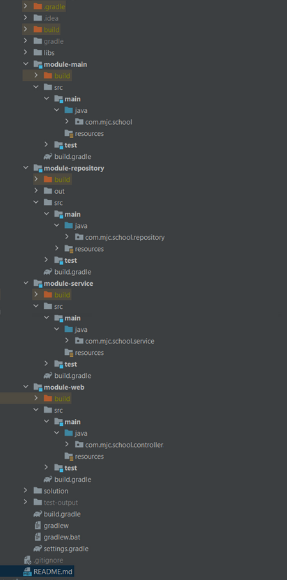
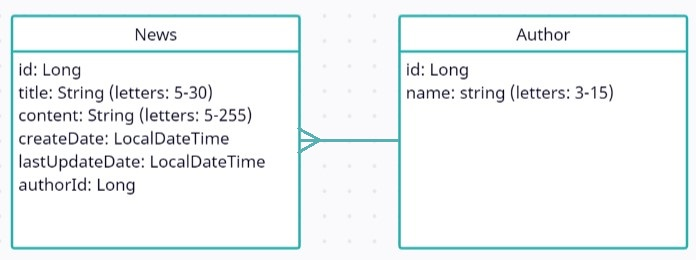

# Architecture advanced

#### Recommended Timeline

The recommended timeline for the whole module is 1 week.

#### Business requirements

Develop multi-module gradle application for <b>News Management</b> system with the following requirements:

* __Modules__

Application should contain 4 modules: module-main, module-web, module-service and module-repository

The structure of the project can be looks like this.



To make loose coupling between modules should be used parametrized interfaces in each module.

__main-module__ used only for running application.

* __DataSource__



- [x] All fields are required.
- [x] _id_ field should be auto generated.
- [x] _title_ field should have length of value from 5 to 30.
- [x] _content_ field should have length of value from 5 to 255.
- [x] _createdDate_, _lastUpdatedDate_ – have [ISO 8601](https://en.wikipedia.org/wiki/ISO_8601) format. Example: 2018-08-29T06:12:15.156. More discussion here: [stackoverflow: how to get iso 8601](https://stackoverflow.com/questions/3914404/how-to-get-current-moment-in-iso-8601-format-with-date-hour-and-minute).
- [x] _authorId_ should be mapped to the author datasource.

The data source should be generated automatically at runtime and saved in array datasource by reading files from the resources folder in the repository module (database emulation).

For example: author.txt, content.txt which should contain the required data.

* __Operations__

The system should expose the following operations from the __main__ module in the root project:

- [x] CRUD operations [(what_is_CRUD)](https://en.wikipedia.org/wiki/Create,_read,_update_and_delete) for News.
- [x] Create operation – fill only title, content, authorId and return created object.
- [x] Get All News operation – return list of objects.
- [x] Get News by id operation – return object by provided news id.
- [x] For update operation – update only title, content, authorId by provided news id and return updated object.
- [x] Delete News operation – delete entity from list objects by provided news id and return boolean value.

All returned and received data should be like [DTO](https://en.wikipedia.org/wiki/Data_transfer_object) type.

The mapping between the DTO and the Model (data source) should be done at the service layer using any library.
For example: [Mapstruct](https://mapstruct.org/), [Modelmapper](http://modelmapper.org/).

* __Testing__
- [x] Cover service layer with JUnit tests

## General requirements:
1. Code should be clean and should not contain any “developer-purpose” constructions.
2. App should be designed and written with respect to OOD and SOLID principles.
3. Clear layered structure should be used with responsibilities of each application layer defined.
4. All business logic should be written in the module-service: mapping model to DTO and vice versa, validation, etc.
5. All the news data should be generated automatically in the module-repository with the amount of 20 and stored in array (database emulation) when the application is running.
   Reading default data for news generating should be from resources package in author.txt, content.txt and news.txt files.
6. module-web and module-service should accept and return dto objects.
7. module-repository should take and return model objects.
8. Convenient error/exception should be implemented: all errors should be meaningful.
   Errors should contain errorMessage and errorCode, where errorCode is your custom code.
9. Application should be tested and pass all tests suites.

## Application requirements:
1. Java 17 should be used.
2. Gradle. Multi-module project.
3. Application packages root: com.mjc.school
4. Java Code Convention is mandatory.

## Solution:

The finished sample application can be found in the [__solution__](./solution/news-management.jar) package at the root of the project, which can be run with the following command:
``` java
   java -jar news-management.jar
```

## Our solution review:
If you have finished task and would like to see the original solution of it written by our experts, write in #stage-3 channel about it. Access will be provided.
